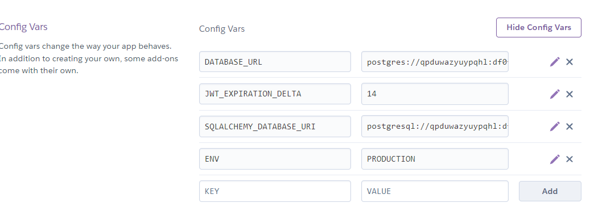

[](https://gitpod.io/#https://github.com/uwidcit/flaskmvc)
[](https://heroku.com/deploy)

# Flask MVC Template
A template for flask applications structured in the Model View Controller pattern [Demo](https://dcit-flaskmvc.herokuapp.com/)


# Dependencies
* Python3/pip3
* Packages listed in requirements.txt

# Installing Dependencies
```
$ pip install -r requirements.txt
```

# Configuration Management


Configuration information such as the database url/port, credentials, API keys etc are to be supplied to the application. However, it is bad practice to stage production information in publicly visible repositories.
Instead, all config is provided by a config file or via [environment variables](https://linuxize.com/post/how-to-set-and-list-environment-variables-in-linux/).

## In Development

When running the project in a development environment (such as gitpod) the app is configured via config.py file in the App folder. By default, the config for development uses a sqlite database.

config.py
```python
SQLALCHEMY_DATABASE_URI = "sqlite:///temp-database.db"
SECRET_KEY = "secret key"
JWT_EXPIRATION_DELTA = 7
ENV = "DEVELOPMENT"
```

## In Production

When deploying your application to production/staging you must pass
in configuration information via environment variables. For heroku, you need to navigate to your application's setting page (url should look like https://dashboard.heroku.com/apps/[app-name]/settings) and scroll down to config vars.
Then provide your configuration by defining the same values given in config.py 



When deploying to production the "ENV" variable should be set to "PRODUCTION". 

**Note** heroku provides a default variable "DATABASE_URL" for heorku postgres. If you want the app to use this database you must copy the value to the variable "SQLALCHEMY_DATABASE_URL" and change the protocol to "postgresql://" for sqlalchemmy.

# Flask Commands

wsgi.py is a utility script for performing various tasks related to the project. You can use it to import and test any code in the project. 
You just need create a manager command function, for example:

```
# inside wsgi.py

user_cli = AppGroup('user', help='User object commands')

@user_cli.cli.command("create-user")
@click.argument("username")
@click.argument("password")
def create_user_command(username, password):
    create_user(username, password)
    print(f'{username} created!')

app.cli.add_command(user_cli) # add the group to the cli

```

Then execute the command invoking with flask cli with command name and the relevant parameters

```
$ flask user create bob bobpass
```


# Running the Project

_For development run the serve command (what you execute):_
```
$ flask run
```

_For production using gunicorn (what heroku executes):_
```
$ gunicorn App.main:app
```

# Deploying
You can deploy your version of this app to heroku by clicking on the "Deploy to heroku" link above.

# Initializing the Database
When connecting the project to a fresh empty database ensure the appropriate configuration is set then file then run the following command. This must also be executed once when running the app on heroku by opening the heroku console, executing bash and running the command in the dyno.

```
$ flask init
```

# Database Migrations
If changes to the models are made, the database must be'migrated' so that it can be synced with the new models.
Then execute following commands using manage.py. More info [here](https://flask-migrate.readthedocs.io/en/latest/)

```
$ flask db init
$ flask db migrate
$ flask db upgrade
$ flask db --help
<<<<<<< Updated upstream
```


# Testing

